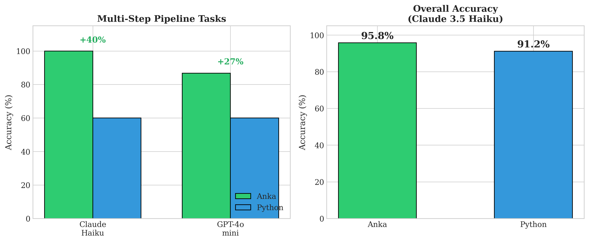

# Anka: A Domain-Specific Language for LLM-Generated Data Transformations

[](https://github.com/yourusername/anka/actions/workflows/ci.yml)
[](https://opensource.org/licenses/MIT)
[](tests/)

**Anka** is a domain-specific language designed for reliable LLM code generation.
Its constrained, explicit syntax reduces common LLM errors, achieving **+40% accuracy
over Python** on multi-step data transformation pipelines.

## Key Results

| Metric | Anka | Python | Advantage |
|--------|------|--------|-----------|
| **Multi-step Tasks** | 100% | 60% | **+40%** |
| Overall Accuracy | 95.8% | 91.2% | +4.6% |
| Parse Success | 99.9% | 100% | - |

*Results validated across Claude 3.5 Haiku and GPT-4o-mini.*



## The Problem

LLMs make predictable errors when generating Python data transformation code:
- Variable shadowing and incorrect references
- Operation ordering mistakes
- Missing intermediate state management

## The Solution

Anka uses constrained, explicit syntax that reduces LLM errors:

```
PIPELINE customer_analysis:
  INPUT orders: TABLE[id: INT, customer_id: INT, amount: DECIMAL, status: STRING]

  STEP filter_active:
    FILTER orders WHERE status == "active" INTO active_orders

  STEP aggregate:
    AGGREGATE active_orders
    GROUP_BY customer_id
    COMPUTE SUM(amount) AS total_spent, COUNT() AS order_count
    INTO customer_summary

  STEP filter_vip:
    FILTER customer_summary WHERE total_spent > 1000 INTO vip_customers

  OUTPUT vip_customers
```

Each step is explicit, named, and connected through `INTO` clauses - preventing the errors LLMs commonly make with Python.

## Why Anka Wins on Multi-Step Tasks

| Python Problem | Anka Solution |
|----------------|---------------|
| Variable shadowing | Explicit `INTO` clauses |
| Wrong operation order | Explicit `STEP` declarations |
| Implicit state | Named outputs for every step |

## Benchmark Results by Category

| Category | Anka | Python | Delta | Winner |
|----------|------|--------|-------|--------|
| **multi_step** | **100.0%** | 60.0% | **+40.0%** | **Anka** |
| finance | **90.0%** | 85.0% | +5.0% | **Anka** |
| aggregate | 100.0% | 100.0% | 0.0% | Tie |
| filter | 96.7% | 100.0% | -3.3% | Python |
| map | 100.0% | 100.0% | 0.0% | Tie |
| strings | 100.0% | 100.0% | 0.0% | Tie |
| hard | 90.0% | 100.0% | -10.0% | Python |
| **Overall** | **95.8%** | 91.2% | **+4.6%** | **Anka** |

### Cross-Model Validation

| Model | Multi-step Advantage |
|-------|---------------------|
| Claude 3.5 Haiku | +40.0% |
| GPT-4o-mini | +26.7% |
| **Average** | **+33.4%** |

## Features

### Data Operations
- `FILTER` - Filter rows by condition
- `SELECT` - Select columns
- `MAP` - Add computed columns
- `SORT` - Sort by column (ASC/DESC)
- `LIMIT` / `SKIP` - Pagination
- `DISTINCT` - Remove duplicates
- `AGGREGATE` - Group and aggregate (SUM, AVG, COUNT, MIN, MAX)
- `JOIN` / `LEFT_JOIN` - Join tables

### File I/O
- `READ` - Load JSON or CSV files
- `WRITE` - Save to JSON or CSV files

### HTTP Operations
- `FETCH` - HTTP GET requests with headers
- `POST` - Send data via HTTP POST

### Control Flow
- `IF/ELSE` - Conditional execution
- `FOR_EACH` - Loop over collections
- `WHILE` - Conditional loops
- `MATCH/CASE` - Pattern matching

## Quick Start

```bash
# Install
pip install -e .

# Run an Anka program
python -m anka examples/hello.anka

# Start the REPL
python -m anka --repl
```

## Running Benchmarks

```bash
# Run full benchmark suite
python -m benchmarks.runner --provider anthropic --model claude-3-5-haiku-20241022 --samples 3

# Run specific categories
python -m benchmarks.runner --provider anthropic --model claude-3-5-haiku-20241022 --categories multi_step,finance
```

## Documentation

- [Syntax Guide](docs/syntax-guide.md)
- [Architecture Decisions](docs/architecture-decisions/)
- [Benchmark Methodology](benchmarks/METHODOLOGY.md)

## Development

```bash
# Clone and install in development mode
git clone https://github.com/yourusername/anka.git
cd anka
pip install -e ".[dev]"

# Run tests
pytest

# Lint and type check
ruff check src/ tests/
mypy src/
```

## Citation

If you use Anka in your research, please cite:

```bibtex
@article{anka2025,
  title={Teaching LLMs Domain-Specific Languages via Prompt:
         Anka, a DSL for Reliable Data Transformation Pipelines},
  author={[Your Name]},
  journal={arXiv preprint arXiv:2025.XXXXX},
  year={2025}
}
```

## Project Statistics

- Grammar rules: 98
- AST node types: 67
- Unit tests: 322 passing
- Benchmark tasks: 100
- Lines of code: ~5,000

## License

MIT License - see [LICENSE](LICENSE) for details.
